# Catalog Match Pipeline

## Problem Overview

This system solves fastener catalog search where users submit free-form hardware requests and receive ranked catalog matches.

### Inputs

- `catalog.csv` — master catalog of parts (SKU, description, active status, etc.)
- `order_history.csv` — customer order history (customer ID, date, SKU, quantity)
- Runtime query input:
  - `query` (free-form text from user)
  - optional `customer_id`

### Expected Outputs

For each query, the API returns:

- top 3 catalog matches
- per-result scores:
  - final match score
  - attribute score
  - embedding score
  - confidence score
- extracted query attributes
- routing metadata (normal vs action vs history query handling)

---

## Preprocessing

Before runtime search, the catalog is enriched offline.

### What preprocessing does

For each catalog description:

1. Extract structured attributes with Ollama LLM:
   - `fastener_type`
   - `thread_size`
   - `length`
   - `material`
   - `grade`
   - `finish`
   - `standard`
2. Generate embedding vector using `nomic-embed-text`
3. Normalize text and write enriched CSV
4. Upload processed catalog into Supabase (`catalog_parts`)

### Why preprocessing exists

- avoids expensive LLM extraction on all catalog rows at query-time
- makes matching deterministic and fast at runtime
- lets SQL/vector search operate on structured + semantic features

---

## End-to-End Diagram

```mermaid
flowchart TD
  subgraph Offline["Offline Preprocessing"]
    A1["catalog.csv"] --> A2["LLM attribute extraction<br/>fastener_type, thread_size, length,<br/>material, grade, finish, standard"]
    A1 --> A3["Embedding generation<br/>nomic-embed-text"]
    A2 --> A4["Merge + normalize rows"]
    A3 --> A4
    A4 --> A5["catalog_processed_v4.csv"]
    A5 --> A6["Supabase catalog_parts<br/>(attributes + embedding)"]
    A7["order_history.csv"] --> A8["Supabase order_history"]
  end

  subgraph Runtime["Runtime Query Pipeline"]
    U["User query + optional customer_id"] --> R1["Layer 1: Query classification<br/>(normal_search | action_catalog | action_history)"]

    R1 -->|normal_search| R2["Resolved query = original query"]
    R1 -->|action_catalog| R3["Fetch catalog candidates from DB<br/>Pre-rank via vector + keyword<br/>Keep top 60<br/>LLM picks best catalog description"]
    R1 -->|action_history| R4["Filter customer order history<br/>Aggregate by SKU (qty, count, recency)<br/>LLM picks best historical item"]

    R3 --> R5["Resolved query string"]
    R4 --> R5
    R2 --> R5

    R5 --> M1["Layer 2: Extract query attributes (LLM)"]
    R5 --> M2["Layer 2: Create query embedding"]
    M1 --> M3["Score every catalog part"]
    M2 --> M3

    M3 --> M4["Attribute score (weighted exact matches)"]
    M3 --> M5["Embedding score (cosine similarity)"]
    M4 --> M6["Final score = 0.60*attr + 0.40*embed"]
    M5 --> M6

    M6 --> H1{"customer_id present AND<br/>query class != action_history?"}
    H1 -->|No| C1["Compute confidence"]
    H1 -->|Yes| H2["History boost<br/>10 most recent orders<br/>boost matching SKUs in top 20"]
    H2 --> C1["Recompute confidence"]

    C1 --> O1["Return top 3 results<br/>+ scores + confidence + routing metadata"]
  end
```

---

## Layer 1: Query Classification and Resolution

Layer 1 converts user language into a robust query string for matching.

### Goal of Layer 1

Go from a potentially abstract request (e.g. “largest washer you have” or “my most purchased product”) to a concrete part description string that can be confidently sent into the core matching pipeline.

### Query classes

Each incoming query is classified by an LLM system prompt into one of:

1. `normal_search`
2. `action_catalog`
3. `action_history`

### 1) `normal_search`

Examples:

- `M8 washer`
- `1/2-13 brass hex nut`

Handling:

- passes query through directly (no query rewriting)

### 2) `action_catalog`

Examples:

- `what is the largest washer you have`
- `I want the shiniest washers`

Handling:

1. Fetch candidate catalog rows from DB
2. Pre-rank candidates with:
   - vector similarity to user query
   - keyword overlap score
3. Keep top **60** candidates
4. Send those top 60 `catalog_id | description` rows to the LLM resolver prompt
5. LLM selects one best catalog description
6. Use that selected description as the resolved query for Layer 2

This avoids dumping the full catalog into prompt context while still allowing semantic “action” interpretation.

### 3) `action_history`

Examples:

- `what is my most purchased product`
- `give me the last washer we bought`

Handling:

1. Filter order history by provided `customer_id`
2. Aggregate by SKU:
   - total quantity ordered
   - order count
   - most recent order date
3. Build compact order-history rows and send to LLM resolver prompt
4. LLM chooses best matching historical SKU/description
5. Resolve to catalog description and pass into Layer 2

If no history exists, system falls back to catalog action resolution.

---

## Layer 2: Attribute + Embedding Matching Pipeline

Layer 2 performs actual ranking of catalog items.

### Step A: Query attribute extraction

The resolved query string from Layer 1 is parsed with the same attribute-extraction model/prompt family used during preprocessing.

### Step B: Query embedding

Create query embedding with `nomic-embed-text`.

### Step C: Score every catalog part

For each part in `catalog_parts`:

1. **Attribute match score** (weighted exact-match over non-null query attributes)
2. **Embedding similarity score** (cosine similarity)
3. **Final score**:

\[
\text{final_score} = 0.60 \times \text{attr_score} + 0.40 \times \text{embedding_score}
\]

### Attribute weights

Used when computing `attr_score`:

- `thread_size`: 0.30
- `fastener_type`: 0.20
- `length`: 0.20
- `material`: 0.10
- `grade`: 0.05
- `finish`: 0.10
- `standard`: 0.05

### History Boost (customer personalization)

Applied only when:

- `customer_id` is present, and
- query class is NOT `action_history` (history already considered there)

Process:

1. Pull customer’s 10 most recent orders
2. Build recency weights per SKU:
   - newest order has strongest weight
3. For top 20 ranked matches, if result SKU appears in recent history:
   - apply multiplicative score boost
4. Re-sort and recompute confidence

Boost formula:

\[
\text{boosted_score} = \min\left(\text{score} \times \left(1 + B\_{\max} \times D \times R\right),\ 1\right)
\]

Where:

- \(B\_{\max} = 0.25\) (max boost strength)
- \(D = \min(\text{recent_orders}/10, 1)\) (history depth factor)
- \(R \in [0,1]\) (recency weight for matching SKU)

UI marks boosted results with:

`Increased score based on customer history`

---

## Confidence Scores

Confidence is independent from match ranking score and is meant for user trust signaling.

### Coverage lookup

Query coverage is based on number of extracted query attributes:

- 0 → 0.00
- 1 → 0.08
- 2 → 0.20
- 3 → 0.45
- 4 → 0.65
- 5 → 0.90
- 6 → 0.95
- 7 → 1.00

### Margin term

Per-rank margin compares score gaps:

- rank 1 uses gap vs rank 2
- rank 2 uses gap vs rank 3
- rank 3 uses fallback from available top margins

Margin is scaled and capped:

\[
\text{margin} = \min\left(2 \times \frac{s*i - s*{i+1}}{s_i},\ 1\right)
\]

### Confidence formula

Current weights:

- `score_power = 0.60`
- `margin_bonus = 0.25`

Formula:

\[
\text{confidence} =
\min\left(
\text{queryCoverage}
\times
\left(\text{final_score}^{\,0.60}\right)
\times
\left(1 + 0.25 \times \text{margin}\right),
1
\right)
\]

Interpretation:

- low-coverage/vague queries are gated down
- strong final scores are amplified (power < 1)
- clear rank separation boosts confidence further

---

## Runtime Flow Summary

1. Receive query (+ optional customer ID)
2. Layer 1 classifies and resolves query text
3. Layer 2 extracts attributes + embedding
4. Rank all catalog parts using weighted hybrid score
5. Apply optional customer-history boost
6. Recompute confidence
7. Return top 3 results + diagnostics
